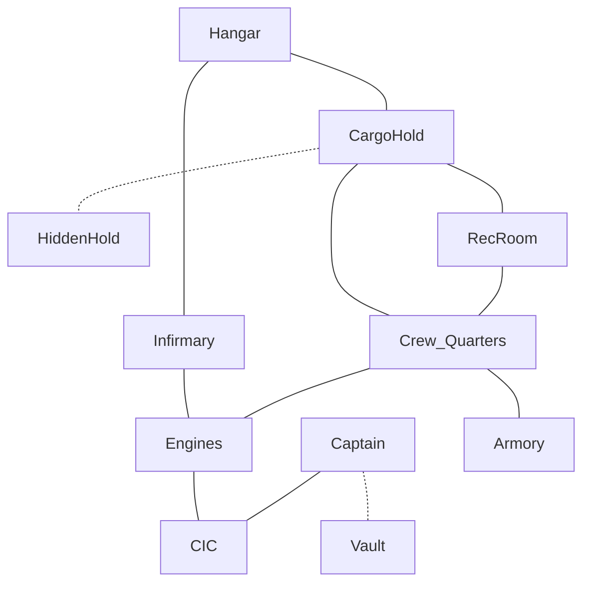

- Failed rebels from another world
- Base needs a new asteroid
- [[Heirs of Carderas]]

# Intro

> [!quote] Approaching the base...
> 
> A pirate operation, haphazard, desultory.  The collected grime on the so-called "temporary" pressure tents betrays a usage beyond design limits.
> 
 > Facilities appear chaotic, only partially complete, and certainly not within standard safety protocols.

![[Aktaj 6.jpeg]]

## Hangar
- **Description:** 
  The hangar is a vast, cold expanse of vacuum, landing pads floating in the emptiness of space. The flatblack surfaces disappear at angles, barely registering on visuals. Cold blue emergency lights glow reluctantly, providing an eerie ambiance.
  
- **Hazard:** 
  This area is exposed to hard vacuum, and irregular grip holds, making movement challenging. 
  
  The defense system is a Level-1 "Kareem" Co-pilot bot expert system, controlling a ship's sandthrower on a 10m tower stalk.  Sensors and power could be compromised with a Fix or Progamming check near the base of the tower.
  
  Approaching ships are interrogated for the security phrase which rotates weekly.
  
- **Thing of Interest:** 
  Secure cargo containers, marked with [[Heirs of Carderas]] paint markings, sit on one of the landing pads. These containers may hold valuable loot, stolen technology, or even captured prisoners.
  
  At the far end of the hangar, obscured by the skeletal frame of a salvaged fighter ship, lies a concealed alcove. A keypad-locked entrance hides a cache of pilfered military-grade drones.  And a Drone Link Control unit (cyber)
  
  These may have been intended for use in the  conflict, waiting for a new pilot bold enough to seize their power.

## Cargo Hold

- **Description:** A dimly lit room filled with contraband and stolen goods.
- **Hazard:** Unstable piles of crates and barrels; a potential collapse if disturbed.
- **Thing of Interest:** A hidden panel revealing a stash of high-tech weaponry.

## Rec Room
- **Description:** Smoky room with holographic card games and betting terminals.
- **Hazard:** Cheating accusations leading to barroom brawls.
- **Thing of Interest:** A hidden safe containing a stash of rare gemstones.
## Crew Quarters
- **Description:** Cramped bunks, personal effects scattered throughout.
- **Hazard:** Vermin infestation; potential for disease.
- **Thing of Interest:** Maps to other hidden pirate bases in the asteroid belt.
## Engines
- **Description:** Noisy machinery and flickering lights, showing signs of makeshift repairs.
- **Hazard:** Leaking coolant with potential electrical malfunctions.
- **Thing of Interest:** Modified propulsion systems for quick escapes.
## Infirmary
- **Description:** Makeshift medical bay with rudimentary equipment.
- **Hazard:** Low on medical supplies; potential for infections.
- **Thing of Interest:** Stolen experimental drugs with unknown effects.
## Armory
- **Description:** Rows of weapon racks and ammunition stores.
- **Hazard:** Faulty security system triggering false alarms.
- **Thing of Interest:** Prototype energy weapons with limited ammunition.

## CIC
- **Description:** High-tech consoles and a panoramic view of space.
- **Hazard:** Damaged navigation controls; potential for a collision.
- **Thing of Interest:** A stolen military encryption device.

## Captain's Quarters
- **Description:** Lavish compared to the rest, with a large ornate desk and a holographic star map.
- **Hazard:** Trapdoor leading to a concealed pitfall.
- **Thing of Interest:** A decrypted communication log revealing upcoming heists.

## Vault
- **Description:** Behind a concealed door, a room with a large, secure vault.
- **Hazard:** Laser tripwires guarding the vault entrance.
- **Thing of Interest:** The pirate captain's personal treasure stash.

## Tech Workshop
- **Description:** Cluttered with salvaged tech, a makeshift repair station.
- **Hazard:** Unstable jury-rigged devices; potential for explosions.
- **Thing of Interest:** An intact AI core from a salvaged military drone.