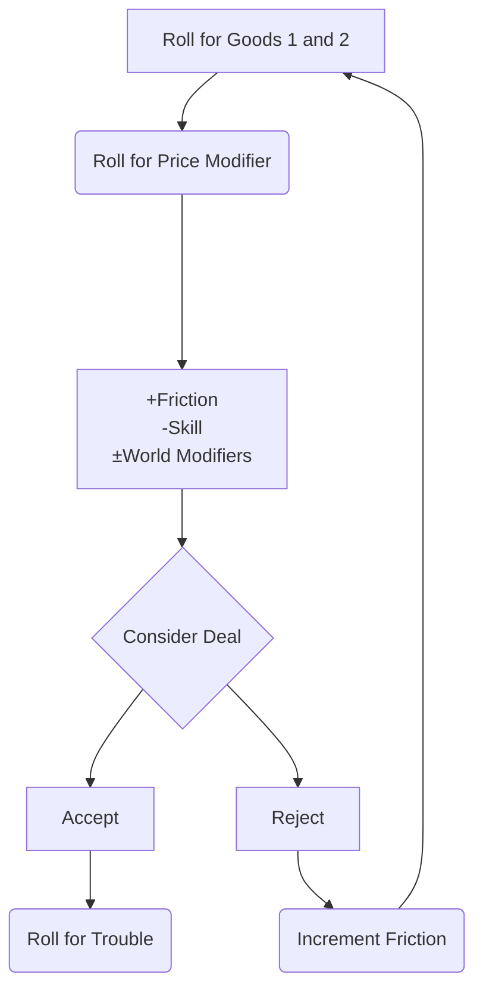

---
tags:
  - game/planet
coords: "0404"
sector: Anona Psi
language:
  - Luxan
---
[[Anona Psi MOC]]
[[Adventure Hooks Around Thora]]


In the [[Heliomachos]] system.  See the [[Anona Psi Travelogue]].

> The Old Ways, The Best Ways.
> -- The Sublime Hierophant, Theourgia Nikophoros

![[thora.jpeg]]

![[farming on thora.jpg]]
# Description

For a history of Thora and environs, [[Sector History]].

Thora is a insular world.  It grudgingly concedes the need to trade, especially with its neighbor [[Ortasto]] for the goods and services it cannot grow in its fertile soil.  Especially desired are **Biotech** and **Tool** goods.

- Recreational Drugs
- Basic Industrial Equipment 
- Medical Equipment
- Gengineered stock
- Agricultural Genes+
- Pretech Industry+

Most citizens are deeply suspicious, fearful or hostile to off-worlders.  Notably, some of the [[Thiera of Thora]] -  Thesauria, Emporia and Harmonia - are more welcoming.

| Aspect      | Details                           |
| ----------- | --------------------------------- |
| Atmosphere  | Breathable mix                    |
| Temperature | Temperate                         |
| Biosphere   | Human-miscible                    |
| Population  | Several million inhabitants       |
| Tech Level  | TL4                               |
| Tag         | [[World Tags#Rigid Culture]]      |
| Tag         | [[World Tags#Minimal Contact]]    |
| Random name | `dice: [[Name Tables^byzantine]]` |
```button
name ⌘ R
type command
action Dice Roller: Re-roll Dice
```


# Restrictions on Off-worlders

- Must wear a red badge on their left shoulder, visible at all times.
- Must never touch a Thoran.
- Must never speak of religion, history, or politics.
- Must stay to the Red zones only, or [[Porta Intacta]].
- Must be accompanied by an authorized guide outside of the port.
- Must only speak Thoran (similar enough to Mandate), or through the guide who will translate.
- Must present their ID to any official who demands it.
- Will be subject to frequent scrutiny if displaying arms and armor.
# Notables

| who                                                                                            | where                                                   |
| ---------------------------------------------------------------------------------------------- | ------------------------------------------------------- |
| [[Exalted Autarch Damocles Kallistrate]], arrogant, impatient.                                 | [[Palace of Unbroken Vigilance]]                        |
| [[Evdokia Niketas]], the Supreme Paragon of [[Citizens of Faultless Virtue]]                   | Hall of the Faithful [[Hierápolis]]                     |
| [[Elena Varro]], a workers' rights advocate and community organizer.                           | The AgriFac outside [[Hierápolis]]                      |
| [[Andronikos Ioannes]], author, activist, intellectual. Champion of the poor and dispossessed. | Between the University and Slum wards of [[Hierápolis]] |
| [[Lady Evadne Alexios]], disdainful, shrewd                                                    | Often a guest at [[Palace of Unbroken Vigilance]]       |
| [[Commander Kyrios Drakon]], ruthless, cruel, unpopular                                        | Hall of War [[Hierápolis]]                              |
| [[Eirene Nikophoros]] xenophilic port engineer                                                 | Starport [[Porta Intacta]]                              |
| [[Alexios Theodosius]] reserved customs officer                                                | Starport [[Porta Intacta]]                              |
| [[Professor Aeneas Xanthopoulos]], garrulous, intrusive busybody.                              | [[Porta Intacta]]                                       |
| [[Iliana Kassandros]], feisty, willful Demiourgos, artisans.                                   | [[Porta Intacta]]                                       |

# Factions

- [[The Whispered Promise]]: Secret society for societal change.
- [[The Golden Quill Society]]: Intellectuals reevaluating history.
- [[Citizens of Faultless Virtue]] Paragons of proper Thoran culture.
# Places

- **[[Hierápolis]]**: The heart of Thora, where the ruling elite resides, and ceremonial rituals and events take place.
- **[[Porta Intacta]]**: The sole point of contact with offworlders, heavily guarded to maintain minimal contact. Acts as a gateway for trade but with strict regulations.
- **[[Ascendant Causeway]]**: A stratified transportation connecting the capital city with the port.
- [[Douglass 8]] The secretive research station located in a deep mine.  Staffed by off-worlder researchers. 

# Ecosphere

Earth-like.  [[Hierápolis]] and [[Porta Intacta]] about 35° north of the equator. It has a dry and hot summer and a cool and rainy winter.  Huge agricultural activity.  Grains, livestock.


# Minimal Contact

The locals refuse most contact with offworlders. Only a small, quarantined treaty port is provided for offworld trade, and ships can expect an exhaustive search for contraband. Local governments may be trying to keep the very existence of interstellar trade a secret from their populations, or they may simply consider offworlders too dangerous or repugnant to be allowed among the population.

## Enemies

| Enemy              | Description                                                             |
| ------------------ | ----------------------------------------------------------------------- |
| Customs Official   | The stern and meticulous customs official at the treaty port.           |
| Xenophobic Natives | Local inhabitants with deep distrust and aversion towards offworlders.  |
| Existing Merchant  | Established local merchant viewing offworlders as unwanted competition. |

## Complications

| Complication             | Description                                                           |
| ------------------------ | --------------------------------------------------------------------- |
| Desperately Needed Goods | Locals possess crucial items but won't bring them to the treaty port. |
| Local Disease            | Locals carry a seemingly harmless disease lethal to outsiders.        |
| Hidden Agendas           | Locals conceal dark purposes from offworlders.                        |

## Friends

| Friend              | Description                                                    |
| ------------------- | -------------------------------------------------------------- |
| Aspiring Tourist    | Enthusiastic individual fascinated by the allure of offworld travels. |
| Anthropological Researcher | Scholar studying the local culture, willing to collaborate. |
| Offworld Thief      | Skilled rogue navigating local customs and aiding the group.   |
| Religious Missionary | Missionary seeking to bridge the gap between locals and offworlders. |

## Things

| Thing                    | Description                                                   |
| ------------------------ | ------------------------------------------------------------- |
| Contraband Trade Goods   | Illicit goods in high demand among offworlders.               |
| Security Perimeter Codes | Crucial codes aiding navigation through restricted zones.     |
| Black Market Local Products | Exotic items available only through underground channels.    |

## Places

| Place                        | Description                                                   |
| ---------------------------- | ------------------------------------------------------------- |
| Treaty Port Bar              | Dimly lit establishment where offworlders gather for transactions. |
| Black Market Zone            | Hidden area thriving with the black market away from authorities. |
| Secret Smuggler Landing Site | Concealed landing site used by smugglers for discreet transport. |

# Rigid Culture

The local culture is extremely rigid. Certain forms of behavior and belief are absolutely mandated, and any deviation from these principles is punished, or else society may be strongly stratified by birth with limited prospects for change. Anything which threatens the existing social order is feared and shunned.

`dice: 1d8 `
`dice: 1d10 `
`dice: 1d10 `
`dice: 1d12 `
## Enemies

| Enemy                | Description                                                    |
| -------------------- | -------------------------------------------------------------- |
| Rigid Reactionary    | A staunch defender of traditional cultural norms.               |
| Wary Ruler           | The ruler is cautious and skeptical of outsiders' influence.    |
| Regime Ideologue     | A fervent believer in the rigid ideology governing the culture. |
| Offended Potentate   | A powerful figure offended by perceived disrespect or deviation. |

## Complications

| Complication                 | Description                                                   |
| ---------------------------- | ------------------------------------------------------------- |
| Enforced Cultural Patterns   | Cultural norms are upheld and enforced through technological aids. |
| Secret Cabal Manipulators    | A clandestine group secretly manipulating the cultural order.  |
| Religious Sanction           | The culture's rigid principles are explicitly sanctioned by religious beliefs. |
| Forgotten Necessities        | The rigid culture evolved due to important necessities that have since been forgotten. |

## Friends

| Friend                   | Description                                                    |
| ------------------------ | -------------------------------------------------------------- |
| Revolutionary Agitator  | An individual seeking to challenge and change the rigid cultural norms. |
| Ambitious Peasant        | A member of the lower caste aspiring to improve their social standing. |
| Frustrated Merchant      | A merchant frustrated by the limitations imposed by the rigid cultural norms. |

## Things

| Thing                           | Description                                                   |
| ------------------------------- | ------------------------------------------------------------- |
| Precious Traditional Regalia    | Artifacts representing the traditional symbols of the culture. |
| Peasant Tribute                 | Offerings made by lower castes to adhere to cultural expectations. |
| Opulent Treasures of the Ruling Class | Luxurious items possessed by the elite ruling class.          |

## Places

| Place                     | Description                                                   |
| ------------------------- | ------------------------------------------------------------- |
| Time-Worn Palace           | An ancient palace where the rulers reside, steeped in tradition. |
| Low-Caste Slums           | Impoverished areas inhabited by the lower caste population.   |
| Bandit Den                | Hidden location used by those rebelling against cultural norms. |
| Reformist Temple          | A temple advocating for reform and change within the culture.  |


# Trade on Thora

```button
name ⌘ R
type command
action Dice Roller: Re-roll Dice
```

| Aspect             | Value                                                    |
| ------------------ | -------------------------------------------------------- |
| World Type         | Agricultural                                             |
| World Modifiers    | -2 Agricultural<br>-1 Livestock<br>+1 Biotech<br>+2 Tool |
| Friction           | 4                                                        |
| Skills, Attributes | Trade, Connect, Talk; Cha, Int                           |
| Trouble chance     | 30%                                                      |
| Sell Good 1        | `dice: [[Thora#^sog-agworld]]`                           |
| Sell Good 2        | `dice: [[Thora#^sog-agworld]]`                           |
| Price Modifer      | `dice: 3d6\|render`                                      |




| Transaction | Modifiers |
| ---- | ---- |
| Buying | +friction, -skill |
| Selling | -friction, +skill |

| Roll Range | Price Modifier |
| ---------- | -------------- |
| 2 or Less  | -90%           |
| 3          | -70%           |
| 4          | -60%           |
| 5          | -50%           |
| 6          | -40%           |
| 7          | -30%           |
| 8          | -20%           |
| 9          | -10%           |
| 10-11      | Base Price     |
| 12         | +10%           |
| 13         | +20%           |
| 14         | +40%           |
| 15         | +60%           |
| 16         | +80%           |
| 17         | +100%          |
| 18         | +150%          |
| 19 or More | +200%          |
^sunsofgold-saleschart
## Trade on Thora

Some autarch or Glorious Leader rules the world with a hard hand, crushing any hint of resistance.  Every tyranny needs enforcers, however, and these words often have a caste of apparatchiks who make their wealth out of arranging opportunities that are technically impermissible. When problems arise, their “friends” are often left to take the full blame for these perfidious crimes against the State.

Few far traders enjoy working with tyrannical worlds. While petty theft and disorder is often well-contained, there is very little to stop some minor official from simply confiscating an entire ship’s cargo except the prospect of future gain or an immediate bit of baksheesh. Business on tyrannical worlds is much more about friendship and favors to the ruling class than it is about technical legalities.


## Trouble


30% Chance

`dice: [[Thora#^sog-trouble-agworld]]`

| Description                                                                         |
| ----------------------------------------------------------------------------------- |
| Cargo infested with mold, 1d4 x 10% of goods sold are ruined                        |
| Farmer's union forces a discount; add 1d4 Friction to this deal                     |
| Harvest going on and labor is scarce; stuck 1d4 weeks before deal is completed      |
| Local grower's customs make this deal harder; stuck for one week and add 1 Friction |
| Natives have allergic reaction to goods; add 2 Friction to this deal                |
| Ship quarantine for plant disease check; stuck there for 1d6+1 weeks                |
^sog-trouble-agworld

| Trouble |
| ---- |
| A bureaucrat squeezes the PCs for 1d4+1 Friction on the deal |
| A security official confiscates 1d6 x 10% of the goods "for the State" |
| Local rebels and/or common thieves stole 1d4 x 10% of the goods  |
| Secret police suspect the PCs of wrong-doing; add 1d6 Friction to the deal  |
| The local ruler levies a fresh tariff for 1d6 more Friction on the deal  |
| The PCs are suspected as spies or rebels; add 1d4+1 Friction  |
^sunsofgold-tyrannical-trouble

## Trade Goods

```button
name ⌘ R
type command
action Dice Roller: Re-roll Dice
```

`dice: [[Thora#^sog-agworld]]`

| Trade Good              | Types                       | Cost   |
| ----------------------- | --------------------------- | ------ |
| Clothing                | Common, Low Tech, Cultural  | 1,000  |
| Drugs, Raw Materials    | Agriculture, Biotech, Bulky | 2,000  |
| Fine Liquor             | Luxury, Low Tech, Compact   | 10,000 |
| Housewares, Basic       | Low Tech, Consumer          | 2,000  |
| Livestock, Common       | Common, Livestock           | 2,000  |
| Livestock, Gengineered  | Livestock, Biotech          | 10,000 |
| Livestock, Luxury Pets  | Livestock, Luxury           | 25,000 |
| Metawheat               | Common, Agricultural, Bulky | 500    |
| Native Artwork          | Cultural, Luxury, Low Tech  | 10,000 |
| Tools, Basic Hand Tools | Low Tech, Tool              | 5,000  |
^sog-agworld

Here's a list of concrete examples for each type of trade good, with some interesting details:

### Clothing
1. **ThermoWeave Garments**: Lightweight, temperature-regulating clothes made from high-tech fibers. These garments adapt to environmental conditions, keeping the wearer cool in hot climates and warm in cold ones. Popular among off-world diplomats visiting extreme environments.
2. **Silk of Zenthara**: A luxurious, iridescent fabric woven from the silk of native Zenthara spiders. It changes color based on the wearer’s mood and is highly prized by the elite of Thora. Rumors persist that the silk has mild psychoactive properties.
3. **Bio-Armor Suit**: A blend of fashion and function, this suit offers both style and protection. The suit’s material hardens upon impact, providing the wearer with light armor while maintaining the appearance of a high-end business outfit.

### Drugs, Raw Materials
1. **Gylenthine**: A psychoactive compound harvested from the Gylenth plant, native to Thora’s equatorial jungles. It enhances cognitive abilities but is highly addictive. Illegal in most systems but sought after by black market traders.
2. **Thoran Red Salt**: A rare mineral extracted from the deep mines of Thora. Used in ancient preservation techniques and as a base for several powerful pharmaceuticals. The salt’s unique properties make it valuable in medical and alchemical circles.
3. **Krystal Dust**: A fine, glittering powder used in both medicine and high-end manufacturing. It’s harvested from the crystalline formations deep within Thora’s mountains. Inhaled in small amounts, it can grant a temporary boost to physical endurance.

### Fine Liquor
1. **Imperial Nectar**: An aged, honey-infused spirit made from the finest ingredients on Thora. It’s distilled in small batches by a secretive guild, with each bottle sealed in a hand-carved wooden case.
2. **Nebula Gin**: A smooth, floral gin distilled with rare botanicals collected from various planets. Known for its vibrant, swirling colors that resemble a nebula when poured over ice.
3. **Voidwine**: A potent, deep red wine fermented in zero gravity aboard ancient space stations. The unique fermentation process gives it an unparalleled smoothness and a slightly metallic aftertaste.

### Housewares, Basic
1. **Kaldorian Pottery**: Simple, sturdy pottery made from the abundant red clay of Thora. Each piece is hand-shaped by local artisans and features traditional patterns that tell the history of the Kaldorian people.
2. **Solar Lamps**: Basic, solar-powered lamps that store energy during the day and provide light at night. They are a staple in rural areas with limited access to power grids.
3. **SynthWood Furniture**: Durable, lightweight furniture made from synthetic wood fibers. Common in middle-class households, it’s known for its resistance to wear and tear.

### Livestock, Common
1. **Thoran Mud Ox**: A sturdy beast of burden used by farmers in the fertile lowlands. The Mud Ox is prized for its strength and endurance, capable of working long hours in harsh conditions.
2. **Sandrunner Fowl**: A small, hardy bird native to Thora’s deserts. It’s farmed for its eggs, which are a staple in local cuisine. The birds are also known for their vibrant plumage.
3. **Plains Grazers**: Herbivorous mammals that roam Thora’s grasslands. They are raised primarily for their meat, which is a common protein source for the lower classes.

### Livestock, Gengineered
1. **SkyWyrm**: A genetically engineered flying reptile used for rapid transportation across Thora’s varied terrain. They are strong, fast, and can carry a single rider or a small amount of cargo.
2. **GlowSheep**: A breed of sheep modified to emit a soft, bioluminescent glow at night. They are farmed for their wool, which is used to make glow-in-the-dark textiles popular among the youth.
3. **Aquapigs**: Amphibious pigs designed to thrive in both aquatic and terrestrial environments. They are farmed in Thora’s wetlands and provide a rich source of protein for coastal communities.

### Livestock, Luxury Pets
1. **Crystal Cat**: A feline species with fur that sparkles like crystals under light. Bred for their beauty and calm demeanor, they are a status symbol among Thora’s elite.
2. **Miniature Drakes**: Tiny, dragon-like creatures that are popular pets for the wealthy. They are intelligent, affectionate, and have a small, harmless flame breath that is more of a party trick than a weapon.
3. **Jewel-Birds**: Exotic birds with feathers that resemble precious gemstones. They are often kept in ornate cages and are known for their melodious songs, which are said to have calming effects.

### Metawheat
1. **SunGold Metawheat**: A golden-hued strain of metawheat that is resistant to drought and pests. It’s a staple crop in the arid regions of Thora and is known for its slightly sweet flavor.
2. **IronStalk Metawheat**: A strain of metawheat with unusually strong stalks that can withstand harsh winds and heavy rainfall. It’s prized for its high yield and is a key component in Thora’s bread production.
3. **ShadowGrain Metawheat**: A dark, almost black variety of metawheat that grows well in low-light conditions. It’s used to make a dense, nutritious bread that is a favorite among Thora’s miners.

### Native Artwork
1. **Obsidian Masks**: Intricately carved masks made from the volcanic obsidian of Thora’s northern mountains. Each mask is unique and is believed to hold the spirit of the land.
2. **Sand Paintings**: Beautiful, ephemeral artworks created using colored sands. These paintings are often made during religious ceremonies and are destroyed afterward, symbolizing the transient nature of life.
3. **Wind Chimes of the Ancients**: Delicate wind chimes crafted from ancient bones and stones. These chimes produce haunting melodies when the wind blows, believed to be the voices of Thora’s ancestors.

### Tools, Basic Hand Tools
1. **Plasma Torch**: A basic but essential tool for cutting through metal. It’s commonly used by shipwrights and mechanics, and its design has remained unchanged for centuries due to its reliability.
2. **Grav-Spanner**: A multi-tool that uses localized gravity manipulation to loosen or tighten bolts of any size. It’s a must-have for any engineer working on Thora’s aging infrastructure.
3. **Ceramite Hammer**: A simple yet effective hammer made from ceramite, a material known for its durability. Used in construction and mining, it’s designed to withstand the harshest conditions.

| Good                      | Types                       | Cost   |
| ------------------------- | --------------------------- | ------ |
| Housewares, Basic         | Low Tech, Consumer          | 2,000  |
| Drugs, Raw Materials      | Agriculture, Biotech, Bulky | 2,000  |
| Metal Ingots, Common      | Common, Mineral, Bulky      | 1,000  |
| Metal Ingots, Rare Alloys | Mineral, Bulky, Rare        | 5,000  |
| Parts, Basic Industry     | Low Tech, Tool              | 5,000  |
| Postech Building Material | Tools, Postech, Bulky       | 10,000 |
| Slaves                    | Sapient                     | 25,000 |
| Small Arms, Energy        | Military, Postech           | 10,000 |
| Small Arms, Projectile    | Military, Low Tech          | 5,000  |
| Tools, Industrial         | Tool, Postech               | 10,000 |
^sunsofgold-tyrannical-world