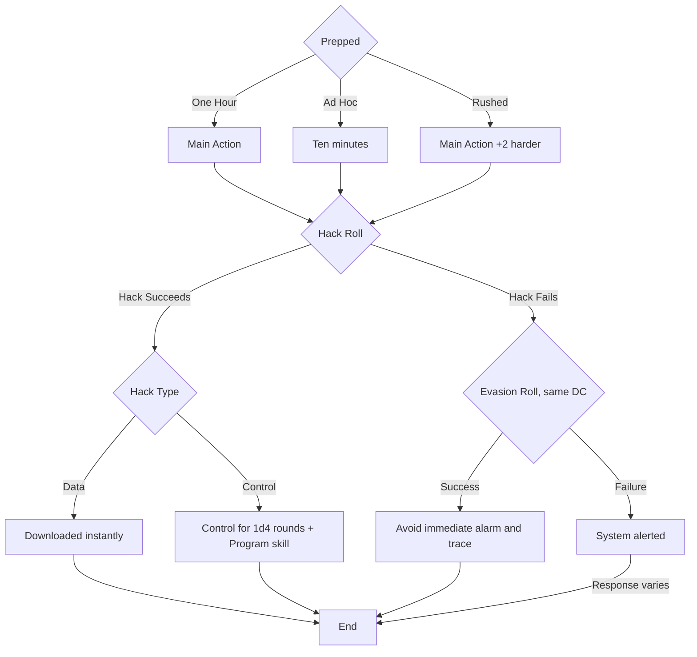

#todo   #game/ref #game/skills

# Combat

## To Hit
- Main Action
- 1d20 + attack bonus + skill level + attribute modifier
- \>= Armor Class
- attack bonus = 1/2 level (warriors; adventurer warriors higher)
- NPCs as listed
- No skill = -2 to hit
## Damage
- weapon’s damage + attribute
- Skill levels do not add to damage unless it is a Punch attack.
### Unarmed
- 1d2 damage + Punch skill
### Shock
- Melee apply Shock
- Shock of **1 point/AC 15** does 1 point on a miss.
- Shock damage + attribute + (weapon mods, foci, or tech)

# Skills
| Skill         | Description                                                                                                                         |
| ------------- | ----------------------------------------------------------------------------------------------------------------------------------- |
| Administer    | Manage an organization, handle paperwork, analyze records, and keep an institution functioning on a daily basis.                    |
| Connect       | Find people who can be helpful to your purposes and get them to cooperate with you.                                                |
| Exert         | Apply trained speed, strength, or stamina in some feat of physical exertion.                                                        |
| Fix           | Create and repair devices both simple and complex.                                                                                  |
| Heal          | Employ medical and psychological treatment for the injured or disturbed.                                                           |
| Know          | Know facts about academic or scientific fields.                                                                                     |
| Lead          | Convince others to also do whatever it is you're trying to do.                                                                      |
| Notice        | Spot anomalies or interesting facts about your environment.                                                                         |
| Perform       | Exhibit some performative skill.                                                                                                    |
| Pilot         | Use this skill to pilot vehicles or ride beasts.                                                                                    |
| Program       | Operating or hacking computing and communications hardware.                                                                         |
| Punch         | Use it as a combat skill when fighting unarmed.                                                                                     |
| Shoot         | Use it as a combat skill when using ranged weaponry.                                                                                 |
| Sneak         | Move without drawing notice.                                                                                                        |
| Stab          | Use it as a combat skill when wielding melee weapons.                                                                               |
| Survive       | Obtain the basics of food, water, and shelter in hostile environments, along with avoiding their natural perils.                    |
| Talk          | Convince other people of the facts you want them to believe.                                                                        |
| Trade         | Find what you need on the market and sell what you have.                                                                            |
| Work          | This is a catch-all skill for professions not represented by other skills.                                                           |

# Space Travel

## Intrasystem

- Within a region: 6 hours
- Between regions: 48 hours

Divide these times by Spike Drive rating.
"Trim the Course", treat your SD as +1; Check Pilot DC 9 or x2 time

## Intersystem (Drills)

- Rutter -- the trail in metadimensional space; has a quality dependent on the time of it's last use.
- max jump in "hexes" = Spike Drive rating of ship
- One load of fuel
- .5 hour to prep
- time to jump 6 days/hex
	- "trim the course" adds +2 risk, but goes faster 
- Drill from any edge of system
- Drill to fixed points in destination (can be guarded)
- Skill: Int/Pilot DC (base 7; rutter age; distance; "trimming"; rushed prep)

# Ship Detection

- A lock is persistent in-system
- acquire lock:
	- same region
	- opposed int/program vs. comms officer
		- lose or tie: no lock, oblivious
			- try again in 24 hours
		- win: locked
			- with active; target knows a lock is made
			- with passive; oblivious

# Hacking

